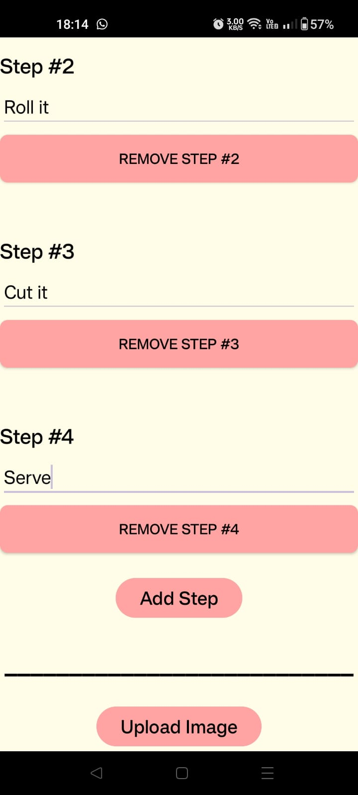

# CookShare

CookShare is a recipe-sharing application designed to allow users to upload, share, and discover new recipes with others. This README provides an overview of the features and technologies used in the CookShare project.

## Features

1. **Firebase Authentication**
   - Users can register and log in securely using Firebase Authentication.
   - Email and password authentication is implemented for user accounts.

2. **Firebase Storage**
   - Recipe images are stored securely using Firebase Storage.
   - Images are fetched and displayed within the application.
   - Images are being uploaded from phone camera/galery.

3. **Firebase Realtime Database**
   - Recipe details such as ingredients, cooking steps, and tags are stored in Firebase Realtime Database.
   - Allows for real-time synchronization and updates across devices.

4. **Android Studio**
   - CookShare is developed using Android Studio, providing a robust development environment for Android applications.

5. **Java**
   - The application is primarily written in Java, leveraging its object-oriented features and Android development frameworks.

6. **RecyclerView**
   - Utilizes RecyclerView to display lists of recipes efficiently.
   - Provides a smooth scrolling experience and dynamic content loading.

7. **Toolbar**
   - Includes a customizable toolbar for easy navigation and access to app features.
   - Supports menu options and actions such as search and profile settings.

8. **Liked Recipes**
   - Every user can like as many recipes he wants.

9. **Recipe Search & Filter**
   - The users can search recipe by name.
   - The users can filter recipes by: my created recipes, liked recipes and by tag (category).

10. **Recipe updation & removal**
    - Every user can update and remove it's own recipes.

11. **Alert dialogs**
    - There is a usage with alert dialogs to verify user logout and recipe removal by user.
   
## Screenshots

## Login screenshots:

| Login | Register | Menu |
| --- | --- | --- |
|  |  |  |

## Main Feed screenshots:

| Main feed | Liked recipes | My recipes | Tag filter |
| --- | --- | --- | --- |
|  |  |  |  |

## Recipe view screenshots:

| Recipe view | Recipe view | Recipe view |
| --- | --- | --- |
|  |  |  |

## Recipe upload:

| Recipe upload | Recipe upload | Recipe upload |
| --- | --- | --- |
|  |  |  |

## Update Recipe screenshots:

| Update recipe | Update recipe | Update recipe | Update recipe | Update recipe |
| --- | --- | --- | --- | --- |
|  |  |  |  |  |

## More views:

| Personal details | Recipe removal |
| --- | --- |
|  |  |
